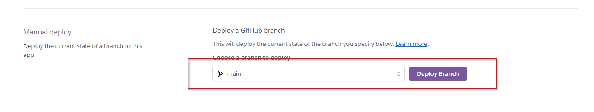

## TABLE OF CONTENTS

## OVERVIEW

This project is designed to enable a fictive restaurant to manage table bookings easily. The users are given the ability to create a booking, write a review or to delete their user accounts or their reviews all together. <u>Staff members are given the possibility to review and cancel bookings after the client has contacted the restaurant for a cancellation.</u> <u>This is a business decision so users dont juggle around with booked tables without the restaurant oner knowing.</u> The site was developed using Django, HTML. CSS and JavaScript.

## UX

### PROJECT GOAL

Create a website for the fictive Urban Food restaurant which useful for the users and the site owner as well.

### PROJECT OBJECTIVES

- Create a simple and intuitive user experience
- Add relevant content for the website
- Differentiate between user and staff accounts
- make the website available and functional across multiple different devices

### SCOPE

#### DELIVER A SIMPLE AND INTUITIVE UX

- Ensure the navigation is available and recognizable as such
- Ensure the pages on the website are named appropriately so the user understands how to use them
- Ensure visual feedback so users know what happens when it happens
- Design the website according to the restaurants color scheme

#### RELEVANT CONTENT

- Ensure that the purpose of the website is visible on the frontpage
- Ensure that the restaurants´ information is visible on the frontpage
- Ensure that user reviews are visible on the frontpage

#### FEATURES

- Register on the website using email and password
- Make CRUD available for:
  - The user profile data
  - The user reviews data
  - The user bookings data
  - The site owner
  - The staff members

#### DISTINCTION BETWEEN ACCOUNTS

- Enable users to add, edit and delete their own reviews on the restaurant
- Enable users to add, change and delete their own user data
- Enable users to add their own bookings

------

- Enable the website owner to view all data from the admin area

------

- Enable staff members to view bookings and cancel them (either from admin or from a custom page)

#### RESPONSIVENESS

- Enable responsiveness for Desktop, Tablets and Phones

### STRUCTURE

The structure of the website is fairly simple. It has Sign up and Log in buttons and only the pages it needs to function. A flowchart is not provided now.

### SKELETON

#### Wireframes

Wireframes can be accessed in the [docs folder](docs/images/readme-images/wireframes/homepage)

### DATABASE
The Urban Food project uses a postgresql database for data storage. This is the final schema:

  
The Urban Food Database

 

### SURFACE

#### COLOR SCHEME

The chosen color scheme is simple but intuitive for a fast food restaurant. The main color chosen is red because it stands for energy and dynamics.

  
Color Scheme

 

#### FONTS

The fonts used on this website are [Poppins](https://fonts.google.com/specimen/Poppins?query=poppins) and [Gabarito](https://fonts.google.com/specimen/Gabarito?query=gabarito) provided by Google Fonts

  
Gabarito Google Font

 

  
Poppins Google Font

 

#### VISUAL EFFECTS

Visual effects are sparsingly used in this project. However, there are some:

- Button hover effects
- The user navigation gets hidden if the user is not logged in
- The navigation menu is designed as a fly out from the right side

## AGILE METHODOLOGY

The use of agile tools can be seen [in the project tab](https://github.com/users/RebellionWebdesign/projects/5) 

## FEATURES

### EXISTING FEATURES

- Register to the website using email and password
- Log in to the website using email and password
- Users can create a profile, edit the data and delete the profile
- Users can create reviews, edit the reviews and delete the reviews
- Users can create bookings, but not delete or edit them. This is a business decision (see overview for details)
- Admin can do all of the above
- One feature that did not make it is the separate staff area. However, this is considered a can have feature because the functionality is there in the admin panel under "Bokings". The app and its model are still in the code to fulfill feature completeness in the future.

### FUTURE FEATURE CONSIDERATIONS

- Finish the staff area page
- Add a menu app so the user can directly order a meal upon booking and see what is on the card
- Refine the booking number calculation

## TOOLS USED

### VSCODE EXTENSIONS

- To ensure that the django templates are formatted correctly, the following [VSCode](https://code.visualstudio.com/) extension was used:
    - [djlint-vscode](https://marketplace.visualstudio.com/items?itemName=monosans.djlint)

### PYTHON PACKAGES

- To further ensure that the [djlint-vscode](https://marketplace.visualstudio.com/items?itemName=monosans.djlint) extension also works, the following
  Python package was used: 
    - [djlint](https://pypi.org/project/djlint/)

- Other packages used - only the main ones installed with `pip install` are listed:
 - [Django v3.2.22](https://pypi.org/project/Django/) please install it with `pip install 'django<4'`
 - [gunicorn](https://pypi.org/project/gunicorn/)
 - [dj_database_url v0.5.0](https://pypi.org/project/dj-database-url/) please install it with `dj_database_url==0.5.0`
 - [psycopg2 v2.9.9](https://pypi.org/project/psycopg2/)
 - [allauth v0.57.0](https://pypi.org/project/django-allauth/)
 - [dj3-cloudinary-storage](https://pypi.org/project/dj3-cloudinary-storage/)
 - [django-summernote](https://pypi.org/project/django-summernote/)

## TESTING

For testing results. please refer to [TESTING.md](TESTING.md)

## DEPLOYMENT

### DEPLOY ON HEROKU

- Log in to your heroku account

- Click on "Settings" and then on "Reveal config vars"

  
Heroku Config Vars

 

- Set your config variables
- Click on the "Deploy" tab and connect your github repo, be sure to follow the prompts.

  
Heroku Github

 

- Click on "Deploy Branch" at the bottom of the page.

  
Heroku Deploy

 

- Heroku will deploy the project now.

### DEPLOY ON A LOCAL MACHINE (Windows)

- Fork the repository from [GitHub](https://github.com/RebellionWebdesign/urban-food)
- Create a venv with python -> `python -m venv venv`
- Activate the venv -> `venv/Scripts/activate`
- Install requirements with pip ->  `pip install -r requirements.txt`
- Check settings.py for the environment variables
- Add your values to the settings.py file (dont forget to create a database of your own beforehand)
- Run the development server with python -> python manage.py runserver

## CREDITS

### CONTENT

- The profile pictures for the fictive users were taken from [RandomUser](https://randomuser.me/photos)
- The hardcoded images on the home page refer to cloudinary, but were shortened with [ShortUrl](https://www.shorturl.at/shortener.php)
- The hero image and the team image on the front page are generated with [MidJourney AI](https://www.midjourney.com/home)
- Some of the reviews were submitted by friends and family.

## ACKNOWLEDGEMENTS

- Thanks to my mentor for being awesome
- Thanks to my family for keeping up with me