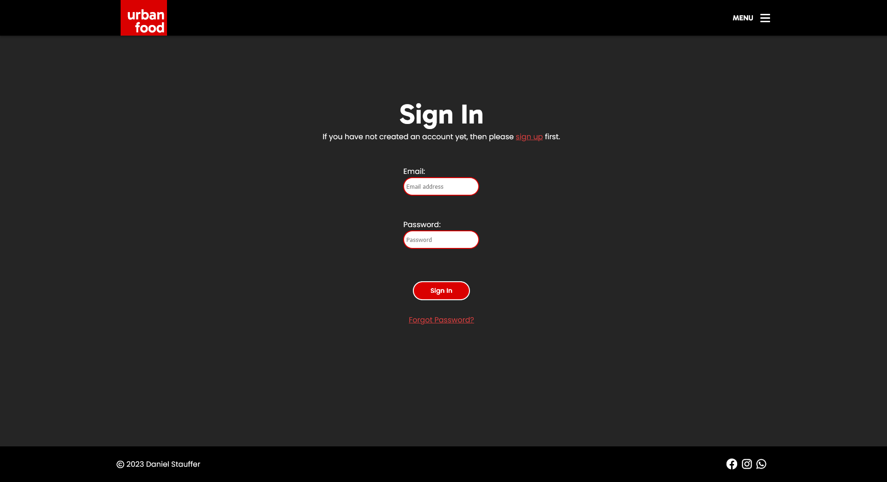

# TESTING

## COMPATIBILITY

To ensure the website works on many different browsers, the website was tested on Chrome and Firefox. Edge and Brave were omitted because they have the same base as Google Chrome (Chromium).

### CHROME:

<details>
  <summary>CHROME DESKTOP HOMEPAGE</summary>
<br>
</details>

<details>
  <summary>CHROME DESKTOP USER</summary>
<br>
</details>

<details>
  <summary>CHROME DESKTOP BOOKING</summary>
<br>
</details>

<details>
  <summary>CHROME DESKTOP REVIEW</summary>
<br>
</details>

<details>
  <summary>CHROME DESKTOP DELETE PAGE</summary>
<br>
</details>

<details>
  <summary>CHROME DESKTOP FORM PAGE</summary>
<br>
</details>

### FIREFOX:

<details>
  <summary>FIREFOX DESKTOP HOMEPAGE</summary>
<br>
</details>

<details>
  <summary>FIREFOX DESKTOP USER</summary>
<br>
</details>

<details>
  <summary>FIREFOX DESKTOP BOOKING</summary>
<br>
</details>

<details>
  <summary>FIREFOX DESKTOP REVIEW</summary>
<br>
</details>

<details>
  <summary>FIREFOX DESKTOP DELETE PAGE</summary>
<br>
</details>

<details>
  <summary>FIREFOX DESKTOP FORM PAGE</summary>
<br>
</details>

## RESPONSIVE BEHAVIOR:

To ensure responsiveness the website was tested on the devtools built into the browsers and Responsively browser.

### CHROME:

<details>
  <summary>CHROME MOBILE HOMEPAGE</summary>
<br>
</details>

<details>
  <summary>CHROME MOBILE USER</summary>
<br>
</details>

<details>
  <summary>CHROME MOBILE BOOKING</summary>
<br>
</details>

<details>
  <summary>CHROME MOBILE REVIEW</summary>
<br>
</details>

<details>
  <summary>CHROME MOBILE DELETE PAGE</summary>
<br>
</details>

<details>
  <summary>CHROME MOBILE FORM PAGE</summary>
<br>
</details>

### FIREFOX:

<details>
  <summary>FIREFOX MOBILE HOMEPAGE</summary>
<br>
</details>

 - For this image the menu was triggered. It is no issue.

<details>
  <summary>FIREFOX MOBILE USER</summary>
<br>
</details>

<details>
  <summary>FIREFOX MOBILE BOOKING</summary>
<br>
</details>

 - There is a small glitch with the container size. See bugs for more information.

<details>
  <summary>FIREFOX MOBILE REVIEW</summary>
<br>
</details>

<details>
  <summary>FIREFOX MOBILE DELETE PAGE</summary>
<br>
</details>

<details>
  <summary>FIREFOX MOBILE FORM PAGE</summary>
<br>
</details>

### RESPONSIVELY:

<details>
  <summary>RESPONSIVELY CRITICAL BREAKPOINTS</summary>
<br>
</details>

## AUTOMATIC TESTING

- Automatic testing was omitted for this project.

## MANUAL TESTING

Manual tests were made by myself, friends and family and CI community members.

|             FEATURE              |               ACTION               |               EXPECTED RESULT               | TESTED | PASSED |
| :------------------------------: | :--------------------------------: | :-----------------------------------------: | :----: | :----: |
|    Navigation: burger icon    |         click icon         |       opens navigation        |  YES   |        YES        |
|     Navigation: logo link     |         click logo         |       sends to homepage       |  YES   |        YES        |
|    Navigation: responsive     |       resize window        |   navigation scales smaller   |  YES   |        YES        |
|   Navigation: hover effects   |    hover over the links    |      links change color       |  YES   |        YES        |
|   Navigation: anchor links    | click 'about' or 'reviews' |    links scroll to section    |  YES   |        YES        |
|  Navigation: user navigation  |           login            |    user navigation appears    |  YES   |        YES        |
|   Navigation: login button    |           log in           |   button changes to logout    |  YES   |        YES        |
| Navigation: close button | click | closes navigation | YES | YES |
| Homepage: sign up button | click | sends to sign up page | YES | YES |
| Homepage: log in button | click | sends to log in page | YES | YES |
| Homepage: social icons | click | sends to respective site | YES | YES |
| Profile: edit info | click | sends to user edit page | YES | YES |
|    Profile: change button     |           click            |       changes user info       |  YES   | PARTLY - see bugs |
| Profile: cancel button | click | sends back to overview | YES | YES |
| Profile: password change link | click | sends to password change | YES | YES |
| Review: new review button | click | sends to new review page | YES | YES |
| Review: delete review button | click | sends to delete review page | YES | YES |
| Review: update review button | click | sends to update review page | YES | YES |
| Review: save review button | click | saves new review | YES | YES |
| Review: back to top button | -- | should be hidden if reviews < 5 | YES | YES |
| Booking: new booking button | click | sends to new booking page | YES | YES |
| Booking: delete booking button | click | sends to delete booking page | YES | YES |
|  Booking: save booking button  |           click            |         saves booking         |  YES   |        YES        |
| Booking: cancel booking button |           click            | sends to back to booking page |  YES   |        YES        |
| Booking: save booking button | click | saves new booking | YES | YES |
| Booking: date picker |         pick date          |         date can not be in the past         |  YES   |        YES        |
| Booking: time picker | pick time | time must be between 12:00 and 23:00 | YES | PARTLY - see bugs |
| Booking: back to top button | -- | should be hidden if bookings < 5 | YES | YES |
| BUTTONS: Hover effects | hover over buttons | button changes color | YES | YES |
| MESSAGES | write a new review | after saving success message gets displayed | YES | YES |

## CODE VALIDATION

#### PYTHON CODE FOR USER

<details>
  <summary>USER MODEL</summary>
<br>
</details>

<details>
  <summary>USER FORMS</summary>
<br>
</details>

<details>
  <summary>USER MANAGER</summary>
<br>
</details>

<details>
  <summary>USER VIEW</summary>
<br>
</details>

<details>
  <summary>USER URL</summary>
<br>
</details>

#### PYTHON CODE FOR BOOKING

<details>
  <summary>BOOKING URL</summary>
<br>
</details>

<details>
  <summary>BOOKING MODEL</summary>
<br>
</details>

<details>
  <summary>BOOKING VIEW</summary>
<br>
</details>

#### PYTHON CODE FOR REVIEW

<details>
  <summary>REVIEW FORMS</summary>
<br>
</details>

<details>
  <summary>REVIEW MODELS</summary>
<br>
</details>

<details>
  <summary>REVIEW URLS</summary>
<br>
</details>

<details>
  <summary>REVIEW VIEW</summary>
<br>
</details>

#### PYTHON CODE FOR HOME

<details>
  <summary>HOME VIEW</summary>
<br>
</details>

<details>
  <summary>HOME URLS</summary>
<br>
</details>

### NU HTML CHECKER

#### HOMEPAGE

<details>
  <summary>HOMEPAGE RESULTS</summary>
<br>
</details>

#### PROFILE PAGES

<details>
  <summary>PROFILE OVERVIEW RESULTS</summary>
<br>
</details>

<details>
  <summary>CHANGE PROFILE RESULTS</summary>
<br>
</details>
- The errors displayed in the W3C-HTML-Checker are due to the following:

  - The form is imported from Django ModelForm, this means the errors do not stem from me but rather from Django itself.

    The forms HTML is not directly editable due to this fact.

  - ERROR 1: The div has the attribute "disabled" which isnt allowed. Adding a display:none rule doesnt help.

  - ERROR 2: Actually no error. If we look at the source code for the page the beginning tag and the end tags for the p element are there,

    but are misplaced:

    The generated Django code:

    ```html
    <p><label for="id_password">Password:</label> <div class="hide" disabled id="id_password">
    <strong>No password set.</strong>
    </div> <span class="helptext">Raw passwords are not stored, so there is no way to see this user’s password, but you can change the password using <a href="../password/">this form</a>.</span></p>
    ```

    The fixed Django code:

    ``````html
    <p>
        <label for="id_password">Password:</label>
    		<div class="hide" disabled id="id_password">
    			<strong>No password set.</strong>
    		</div> 
    		<span class="helptext">
                Raw passwords are not stored, so there is no way to see this user’s password, but you can change the 
                password using <a href="../password/">this form</a>.
    		</span>
    </p>
    ``````

    Please note the correct placing of the p tag.

    - ERROR 3: This error is a follow up error from ERROR 2, removing the "hide" class results in exactly the same error.


<details>
  <summary>DELETE PROFILE RESULTS</summary>
<br>
</details>

#### BOOKING PAGES

<details>
  <summary>BOOKING OVERVIEW RESULTS</summary>
<br>
</details>

<details>
  <summary>NEW BOOKING RESULTS</summary>
<br>
</details>

<details>
  <summary>DELETE BOOKING RESULTS</summary>
<br>
</details>

#### REVIEW PAGES

<details>
  <summary>REVIEW OVERVIEW RESULTS</summary>
<br>
</details>

<details>
  <summary>DELETE REVIEW RESULTS</summary>
<br>
</details>

<details>
  <summary>NEW REVIEW RESULTS</summary>
<br>
</details>

### JSHINT JS CHECKER

<details>
  <summary>JSHINT RESULTS</summary>
<br>
</details>

### JIGSAW CSS CHECKER

<details>
  <summary>JIGSAW RESULTS</summary>
<br>
</details>

### WAVE ACCESSIBILITY CHECKER

<details>
  <summary>WAVE RESULTS</summary>
<br>
</details>

## LIGHTHOUSE REPORTS

<details>
  <summary>LIGHTHOUSE DESKTOP</summary>
<br>
</details>

<details>
  <summary>LIGHTHOUSE MOBILE</summary>
<br>
</details>

## BUGS

### USERS CANT CHANGE THEIR USER IMAGE

- Due to an unresolved bug in the code users cannot change their user image at the moment. However, the code is functional except of this feature. Reason is that the image is not uploaded to cloudinary. However, the user user gets presented a default image for now.

### SMALL GLITCH WITH FIREFOX MOBILE

- On firefox mobile the review cinatinaers dint take the css rule of `height: auto;`. The fix would be to check the correctness of the media query where the glitch happens. Omitted due to time constraint.

### TIME PICKER WORKS WITH MIN AND MAX TIMES, BUT DOES NOT DEACTIVATE THEM

- The time picker on the bookings page is set to a min and max time. This works as expected, but for now the times which cannot be chosen arent deactivated. The user gets an notification about this.

## FURTHER NOTES ON DATA VALIDATION

- Input validation is handled completely by Django. The forms used in the application are django ModelForms injected with the `form.as_p` tag. The only exception is the user change form. The form is directly copied from the source code and changed to have the relevant html tags and classes.
